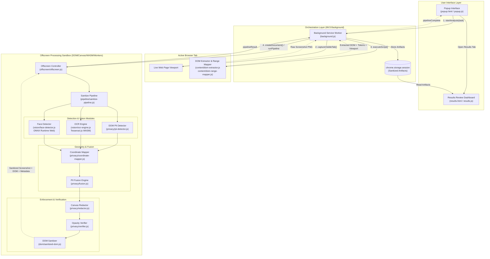

# Privamon — Browser Extension Architecture

## 1. Executive Summary & Core Philosophy

**Privamon** is a client-side, privacy-preserving browser extension built under Google Chrome's **Manifest V3 (MV3)** architecture. Its mission is to act as an untrusted-data firewall between the user's live browser session and downstream AI agent workflows.

Before any visual screenshot or structured DOM data is permitted to exit the browser or be consumed by an automated agent, Privamon intercepts the raw screen capture and DOM tree, detects all Personally Identifiable Information (PII), credentials, and human faces **locally on the client machine**, applies solid, irreversible pixel redactions (`#000000`) and text token sanitization, and verifies that no sensitive data remains unredacted.

### Core Architecture Principles
1. **Zero-Leakage Guarantee**: Raw screenshots and unredacted DOM representations never leave the local environment.
2. **Multi-Modal Triangulation**: PII is discovered by cross-referencing three distinct data streams:
   - **DOM Semantics**: Input attributes, autocomplete metadata, label associations, and rendered text nodes.
   - **Optical Character Recognition (OCR)**: In-browser Tesseract.js WASM running on cropped pixel-bearing DOM regions.
   - **Computer Vision**: BlazeFace/UltraFace deep learning models running client-side via ONNX Runtime Web.
3. **Strict Viewport Synchronization**: Guarantees that the physical screenshot pixels and extracted DOM nodes reflect the exact same rendering frame without scroll or zoom distortion.
4. **Defense-in-Depth Verification**: Never assumes a redaction succeeded; actively inspects canvas pixels post-redaction and auto-expands bounding boxes if any residual data is detected.

---

## 2. High-Level Architecture Diagram



---

## 3. Structural Components & Responsibilities

### 3.1. Extension Manifest (`manifest.json`)
The extension is built strictly on **Chrome Manifest V3**:
- **Permissions**:
  - `activeTab`: Access to the current tab to capture and inspect content upon user trigger.
  - `scripting`: Programmatic injection of the DOM extraction scripts.
  - `offscreen`: Spawning an offscreen document for heavy processing (Canvas 2D, Web Workers, WASM).
  - `storage`: Temporary storage of pipeline outputs across extension tabs.
- **Host Permissions**: Whitelists `http://127.0.0.1/*` and `http://localhost/*` for optional ultra-low latency integration with local Python ML engines.
- **Content Security Policy**: Configured with `script-src 'self' 'wasm-unsafe-eval'` to allow Tesseract.js and ONNX Runtime to compile WebAssembly in the offscreen sandbox.

---

### 3.2. Background Service Worker (`background.js`)
The central event coordinator and lifecycle manager:
1. **Atomic Frame Synchronization**:
   - Captures the visual frame first via `chrome.tabs.captureVisibleTab(null, { format: 'png' })`.
   - Injects content extraction scripts immediately after (within milliseconds), guaranteeing identical viewport coordinate alignment.
2. **Offscreen Lifecycle Management**:
   - Checks for an existing offscreen document using `chrome.runtime.getContexts`.
   - Lazily creates `offscreen/offscreen.html` with `chrome.offscreen.Reason.WORKERS` and `chrome.offscreen.Reason.BLOBS` if not already open.
3. **Bi-directional Relaying**:
   - Routes real-time stage progress updates (`capture`, `dom`, `ocr`, `vision`, `fusion`, `redaction`, `verify`) from the offscreen pipeline to the popup UI.
4. **Artifact Persistence**:
   - Stores the final sanitized screenshot, candidate detections, review list, DOM nodes, and latency metrics in `chrome.storage.session`.

---

### 3.3. Content Layer (`content/`)
Injected dynamically on-demand; no persistent background footprint in web pages.

#### `content/dom-extractor.js`
- Traverses the active viewport to identify visible interactive, semantic, and pixel-bearing elements.
- Gathers full viewport telemetry: `cssViewportWidth`, `cssViewportHeight`, `devicePixelRatio`, `visualViewport` offsets, and scroll state.
- Inspects form field semantics (`type="password"`, `autocomplete="cc-number"`, sensitive `id`/`name`/`class` patterns).
- Filters out non-visible elements (`visibility: hidden`, `display: none`, `opacity: 0`, and elements outside viewport bounds).
- Isolates pixel-bearing elements (``, `<canvas>`, `<video>`, `<svg>`) for downstream OCR/Vision.

#### `content/dom-range-mapper.js`
- Solves the problem of sub-element and wrapped text localization using the browser native `Range.getClientRects()` API.
- Traverses visible text nodes with `document.createTreeWalker`.
- Tokenizes words while computing exact pixel-level rectangles for each word, handling:
  - Text split across inline markup (e.g., `<span>John</span> <strong>Doe</strong>`).
  - Multi-line wrapped text (extracting per-line bounding boxes rather than an imprecise monolithic element box).
  - Generates stable token IDs (`dom-tok-0`, `dom-tok-1`) for precise attribution.

---

### 3.4. Offscreen Execution Sandbox (`offscreen/`)
Because Manifest V3 background service workers lack access to the HTML DOM, Canvas API, `Image` objects, and standard Web Workers, Privamon delegates all computational processing to an offscreen document (`offscreen/offscreen.html`).

#### `offscreen/offscreen.html`
- Headless, invisible document hosting:
  - Vendor libraries: Tesseract.js (`lib/tesseract/tesseract.min.js`) and ONNX Runtime Web (`lib/onnx/ort.min.js`).
  - Detection modules (`pii-detector.js`, `pii-classifier.js`, `fusion.js`, `coordinate-mapper.js`, `redactor.js`, `verifier.js`).
  - Vision modules (`ocr-engine.js`, `vision-model.js`, `face-detector.js`).
  - Master pipeline orchestrator (`sanitize-pipeline.js`).

#### `offscreen/offscreen.js`
- Listens for `runPipeline` events from `background.js`.
- Executes `Privamon.SanitizePipeline.run()`.
- Dispatches progress heartbeats back to the background worker.

---

### 3.5. User Interface Layer
- **Popup (`popup.html` / `popup.js` / `popup.css`)**:
  - Compact UI launched from the extension toolbar.
  - Allows user to specify a task prompt.
  - Displays a live step-by-step progress checklist with per-stage latency timings.
  - Features quick summary badges and a direct link to open the results dashboard.
- **Results Review Dashboard (`results.html` / `results.js` / `results.css`)**:
  - Full-screen interactive analysis and review console.
  - **4 Visualization Modes**:
    - *Side-by-Side*: Original vs. Redacted comparison.
    - *Toggle*: Instant keyboard/button hot-swap between original and sanitized.
    - *Slider*: Split-curtain swipe comparison.
    - *Overlay*: Interactive color-coded bounding boxes over the sanitized canvas.
  - **Interactive Bounding Box Inspector**: Click any box to inspect source, category, confidence score, and raw text.
  - **Review & Triage**: Supports marking detections as `REDACT`, `REVIEW`, or `KEEP`, with manual box drawing for ad-hoc redaction.
  - **Sanitized DOM Viewer**: Formatted, syntax-highlighted display of the stripped DOM tree with one-click clipboard copying.
  - **Export Options**: Download sanitized image (PNG) or structured JSON audit logs.

---

## 4. The 9-Stage Sanitization Pipeline

The master pipeline (`pipeline/sanitize-pipeline.js`) executes in a sequential, fault-tolerant pipeline within the offscreen document:

```
[Raw Screenshot + DOM Data]
            │
            ▼
 ┌─────────────────────────────────────────┐
 │ Stage 1: DOM PII Detection              │  --> Hybrid regex + HTML semantics + Indian PII
 └─────────────────────────────────────────┘
            │
            ▼
 ┌─────────────────────────────────────────┐
 │ Stage 2: Pixel Region Selection         │  --> Heuristic filtering of image/canvas candidates
 └─────────────────────────────────────────┘
            │
            ▼
 ┌─────────────────────────────────────────┐
 │ Stage 3: OCR Processing                 │  --> Tesseract.js WASM on cropped candidate boxes
 └─────────────────────────────────────────┘
            │
            ▼
 ┌─────────────────────────────────────────┐
 │ Stage 4: Vision Analysis (Face Detect)  │  --> BlazeFace / UltraFace via ONNX Runtime Web
 └─────────────────────────────────────────┘
            │
            ▼
 ┌─────────────────────────────────────────┐
 │ Stage 5: Coordinate Space Mapping       │  --> CSS viewport coordinates -> Physical image pixels
 └─────────────────────────────────────────┘
            │
            ▼
 ┌─────────────────────────────────────────┐
 │ Stage 6: PII Fusion & Arbitration       │  --> IoU clustering, containment & confidence arbitration
 └─────────────────────────────────────────┘
            │
            ▼
 ┌─────────────────────────────────────────┐
 │ Stage 7: Canvas Redaction               │  --> Solid opaque black fill (#000000)
 └─────────────────────────────────────────┘
            │
            ▼
 ┌─────────────────────────────────────────┐
 │ Stage 8: Verification & Re-Redaction    │  --> Monochrome pixel audit + 25% safety expansion
 └─────────────────────────────────────────┘
            │
            ▼
 ┌─────────────────────────────────────────┐
 │ Stage 9: DOM Sanitization               │  --> Text & value replacement in extracted DOM tree
 └─────────────────────────────────────────┘
            │
            ▼
[Sanitized Artifacts -> chrome.storage.session]
```

### Stage-by-Stage Breakdown

#### Stage 1: DOM PII Detection (`privacy/pii-detector.js`)
- Runs first on all text-bearing and input DOM nodes extracted from the page.
- Evaluates:
  - **HTML Semantics**: Sensitive `type` (`password`, `email`, `tel`), `autocomplete` (`cc-number`, `bday`, etc.), and input names (`ssn`, `aadhaar`, `cvv`, `salary`).
  - **Global PII Regexes**: Email addresses, International/US phone numbers, Credit Cards (validated with **Luhn Checksum Algorithm**), SSN, IPv4/IPv6, API Keys, Private Keys, JWT tokens.
  - **Indian PII Patterns**:
    - **Aadhaar Numbers**: 12-digit format validated with the **Verhoeff Checksum Algorithm** (multiplication and permutation matrices).
    - **PAN Numbers**: Indian permanent account numbers verified against the 10-character alphanumeric structure (`[A-Z]{5}[0-9]{4}[A-Z]`).
    - **Indian Mobile Numbers**: Standard 10-digit formats with `+91` / `0` prefixes.
    - **IFSC Codes**: Bank branch identifiers.
- **Adaptive Engine Fallback**: If a local Python backend is active at `127.0.0.1:8765`, it leverages batch Presidio + GLiNER NLP models; otherwise, it executes entirely in-browser using deterministic JavaScript regex and checksum logic with zero degradation in uptime.

#### Stage 2: Pixel Region Selection (`vision/ocr-engine.js`)
- Inspects all visual elements (``, `<canvas>`, SVG graphics) extracted by the DOM scanner.
- Applies heuristic filters to avoid wasting CPU/GPU time on:
  - Tiny icons and decorative glyphs (e.g., `< 16px`).
  - Giant full-page background images.
  - Elements with non-standard aspect ratios unlikely to contain text or faces.

#### Stage 3: OCR Processing (`vision/ocr-engine.js`)
- Initializes a Tesseract.js WebAssembly worker with English (`eng`) and Hindi (`hin`) trained data.
- Crops each selected candidate image region from the raw screenshot on an offscreen canvas.
- Reconstructs word tokens with confidence metrics, character offsets, and physical bounding boxes.
- Submits extracted text through `PIIDetector` to flag text PII embedded inside images.

#### Stage 4: Vision Analysis & Face Detection (`vision/face-detector.js`)
- Implements the `VisionModel` interface.
- Loads `blazeface.onnx` or `version-RFB-320-clean.onnx` via ONNX Runtime Web.
- Preprocesses cropped image regions to `320x240` tensors with mean subtraction and normalization.
- Runs inference and decodes bounding boxes with Non-Maximum Suppression (NMS) to detect human faces (e.g., profile pictures, ID badges, team photos).

#### Stage 5: Coordinate Space Mapping (`privacy/coordinate-mapper.js`)
- Unifies coordinate spaces:
  - DOM elements provide CSS viewport-relative coordinates via `getBoundingClientRect()`.
  - The raw screenshot contains physical pixels (influenced by `devicePixelRatio` and display scaling).
- **Core Realization**: Because both `captureVisibleTab()` and `getBoundingClientRect()` are strictly viewport-relative, **no scroll offsets are subtracted**.
- Derives dynamic scaling ratios:
  $$\text{scaleX} = \frac{\text{screenshotWidth}}{\text{cssViewportWidth}}, \quad \text{scaleY} = \frac{\text{screenshotHeight}}{\text{cssViewportHeight}}$$
- Maps all DOM bounding boxes into physical screenshot pixel coordinates so they can be merged directly with OCR and Vision boxes.

#### Stage 6: PII Fusion & Arbitration (`privacy/fusion.js`)
- Ingests detections from all three sources: DOM, OCR, and Vision.
- Computes **Intersection over Union (IoU)** between all candidate boxes:
  $$\text{IoU}(A, B) = \frac{\text{Area}(A \cap B)}{\text{Area}(A \cup B)}$$
- Merges overlapping boxes above `IOU_THRESHOLD = 0.4` or parent-child containment boxes into unified clusters.
- Classifies each candidate into one of three action states:
  - `REDACT`: High-confidence PII or sensitive inputs.
  - `REVIEW`: Ambiguous or borderline confidence detections flagged for user inspection.
  - `KEEP`: Contextually benign or non-sensitive elements.

#### Stage 7: Canvas Redaction (`privacy/redactor.js`)
- Loads the raw screenshot into an offscreen HTML5 `CanvasRenderingContext2D`.
- For every item in the `REDACT` set:
  - Sets `ctx.fillStyle = '#000000'`.
  - Calls `ctx.fillRect(bbox.x, bbox.y, bbox.width, bbox.height)` to permanently obliterate underlying pixels.
- Exports the redacted canvas as a new PNG Data URL.

#### Stage 8: Verification & Re-Redaction (`privacy/verifier.js`)
- Validates the integrity of the redaction:
  - Extracts each redacted bounding box from the resulting image.
  - Samples pixel data via `ctx.getImageData()`.
  - Checks if every pixel in the bounding box is strictly opaque black (`R=0, G=0, B=0, A=255`).
- **Safety Padding & Re-Redaction**:
  - If non-black pixels are discovered (caused by anti-aliasing bleed or sub-pixel misalignment), the bounding box is expanded by **25%** (`EXPAND_FACTOR = 0.25`) in all directions and re-redacted on the canvas.

#### Stage 9: DOM Sanitization (`dom/sanitized-dom.js`)
- Iterates over the extracted DOM structure.
- Matches elements associated with confirmed redactions.
- Replaces raw text nodes, input values, and placeholder attributes with deterministic privacy tokens:
  - `user@example.com` $\rightarrow$ `[REDACTED: email]`
  - `+91 98765 43210` $\rightarrow$ `[REDACTED: phone]`
  - Passwords and card numbers $\rightarrow$ `[REDACTED: password]` / `[REDACTED: card]`
- Produces a sanitized, agent-safe DOM representation.

---

## 5. Key Data Structures & Contracts

### 5.1. Common Candidate Detection Object
```typescript
interface DetectionCandidate {
  type: string;                   // 'email' | 'phone' | 'aadhaar' | 'pan' | 'face' | 'password' | ...
  source: 'dom' | 'ocr' | 'vision';
  text?: string;                  // Matched text content (null for faces)
  bbox: {                         // Coordinates normalized to physical screenshot pixels
    x: number;
    y: number;
    width: number;
    height: number;
  };
  confidence: number;             // 0.0 to 1.0
  decision: 'REDACT' | 'REVIEW' | 'KEEP';
  elementId?: string | null;     // Associated DOM element ID or selector
  tokens?: string[];              // Range-mapped DOM token IDs (e.g. ['dom-tok-12'])
  reason?: string;                // Justification for the classification
}
```

### 5.2. Viewport Information Object
```typescript
interface ViewportInfo {
  cssViewportWidth: number;       // window.innerWidth
  cssViewportHeight: number;      // window.innerHeight
  devicePixelRatio: number;       // window.devicePixelRatio
  scrollX: number;                // window.scrollX
  scrollY: number;                // window.scrollY
  estimatedZoom: number;          // Visual viewport scale
}
```

### 5.3. Final Pipeline Storage Contract (`privamon_result`)
Stored in `chrome.storage.session`:
```typescript
interface PrivamonPipelineResult {
  sanitizedScreenshot: string;    // Base64 PNG data URL with solid black fills
  detections: DetectionCandidate[];
  allCandidates: DetectionCandidate[];
  redactions: DetectionCandidate[]; // Detections where decision === 'REDACT'
  reviews: DetectionCandidate[];    // Detections where decision === 'REVIEW'
  kept: DetectionCandidate[];       // Detections where decision === 'KEEP'
  ocrWords: Array<{ text: string; confidence: number; bbox: object }>;
  detectionSummary: {
    total: number;
    byType: Record<string, number>;
    bySource: Record<string, number>;
  };
  sanitizedDom: Array<SanitizedElement>;
  ocrRawText: string;
  timings: {
    capture: number;
    dom: number;
    domPiiDetection: number;
    pixelIdentification: number;
    ocr: number;
    vision: number;
    coordinateMapping: number;
    fusion: number;
    redaction: number;
    verification: number;
    domSanitization: number;
    total: number;
  };
  metadata: {
    screenshotDimensions: { width: number; height: number };
    viewportInfo: ViewportInfo;
    coordinateScale: { x: number; y: number };
    domStats: { totalExtracted: number };
    verificationPassed: boolean;
    reRedacted: boolean;
    warnings: string[];
    engineHealth: { online: boolean; glinerReady: boolean; presidioReady: boolean };
  };
  timestamp: number;
}
```

---

## 6. Directory Map (Extension Only)

```
Privamon/
├── manifest.json              # Extension manifest (MV3 permissions, CSP, resources)
├── background.js              # Background service worker (event & lifecycle orchestrator)
│
├── popup.html                 # Extension toolbar popup interface
├── popup.js                   # Popup UI controller & stage progress listener
├── popup.css                  # Popup styling & progress bar animations
│
├── results.html               # Comprehensive results & inspection dashboard
├── results.js                 # Dashboard logic (4 comparison modes, interactive boxes)
├── results.css                # Dashboard styling
│
├── content/
│   ├── dom-extractor.js       # Content script: viewport DOM crawler & attribute inspector
│   └── dom-range-mapper.js    # Character/word-level Range.getClientRects coordinate mapper
│
├── offscreen/
│   ├── offscreen.html         # Headless DOM/Canvas/Worker sandbox container
│   └── offscreen.js           # Sandbox controller executing the sanitize pipeline
│
├── pipeline/
│   └── sanitize-pipeline.js   # Master 9-stage sanitization pipeline orchestrator
│
├── privacy/
│   ├── pii-detector.js        # Regex patterns, Verhoeff/Luhn checksums, HTML semantic rules
│   ├── pii-classifier.js      # Extensible confidence & risk classifier
│   ├── coordinate-mapper.js   # Viewport CSS-to-screenshot physical pixel scaling
│   ├── fusion.js              # Multi-modal IoU deduplication & conflict resolution
│   ├── redactor.js            # HTML5 Canvas opaque rectangle rasterizer (#000000)
│   └── verifier.js            # Post-redaction pixel opacity verification & padding expansion
│
├── vision/
│   ├── ocr-engine.js          # Tesseract.js WASM wrapper, cropping, & word-to-span mapping
│   ├── vision-model.js        # Generic vision model registry interface
│   └── face-detector.js       # BlazeFace/UltraFace face detector via ONNX Runtime Web
│
├── dom/
│   └── sanitized-dom.js       # Strips PII from extracted DOM nodes & replaces with tokens
│
├── profile/
│   └── local-vault.js         # Local secure user profile schema stub (client-side only)
│
├── lib/
│   ├── tesseract/             # Bundled Tesseract.js worker and core WASM assets
│   └── onnx/                  # ONNX Runtime Web scripts & BlazeFace ONNX models
│
├── icons/                     # Extension branding icons (16px, 48px, 128px)
└── eng.traineddata / hin.traineddata # Pre-packaged OCR language models
```
